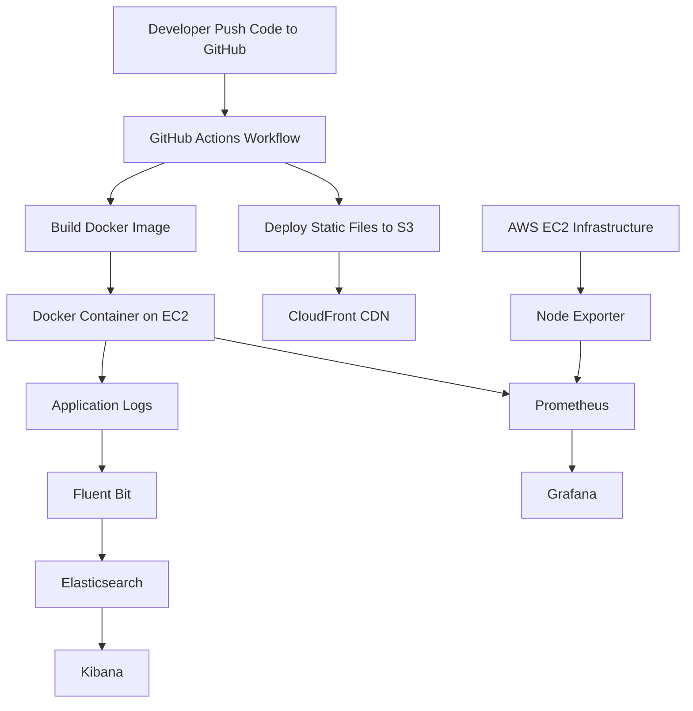
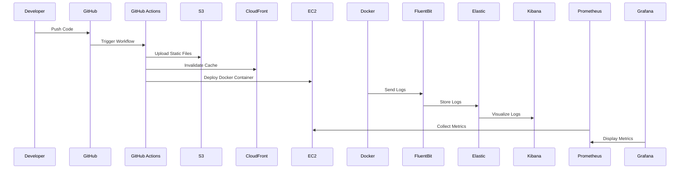

# Hostel Billing DevOps Monitoring Project

A complete DevOps implementation for the **Hostel Billing Application** with:

- Docker Containerization
- AWS EC2 Deployment
- GitHub Actions CI/CD
- S3 Static Website Hosting
- CloudFront CDN
- Prometheus Monitoring
- Grafana Dashboard
- Elasticsearch Logging
- Kibana Visualization
- Fluent Bit Log Forwarding

---

# Complete Workflow Architecture



---

# Project Structure

```bash
hostel-billing/
│
├── .github/
│   └── workflows/
│       └── deploy.yml
│
├── Dockerfile
├── docker-compose.yml
├── hostel.html
├── logo.png.png
└── README.md
```

---

#  Technologies Used

| Tool | Purpose |
|------|----------|
| Docker | Containerization |
| AWS EC2 | Hosting |
| S3 Bucket | Static Website Storage |
| CloudFront | CDN |
| GitHub Actions | CI/CD Pipeline |
| Prometheus | Monitoring |
| Grafana | Visualization |
| Elasticsearch | Log Storage |
| Kibana | Log Visualization |
| Fluent Bit | Log Forwarding |
| Node Exporter | EC2 Metrics |

---

# AWS Services Used

## EC2
Used for:
- Docker containers
- Monitoring stack
- Logging stack

---

## S3 Bucket
Used for:
- Static website deployment

---

## CloudFront
Used for:
- CDN distribution
- Faster content delivery

---

# 🐳 Docker Containerization

## Dockerfile

```dockerfile
FROM nginx:alpine

COPY hostel.html /usr/share/nginx/html/index.html
COPY logo.png.png /usr/share/nginx/html/

RUN rm /etc/nginx/conf.d/default.conf

RUN printf 'server {\n\
listen 80;\n\
location / {\n\
root /usr/share/nginx/html;\n\
index index.html;\n\
}\n\
access_log /dev/stdout;\n\
error_log /dev/stderr;\n\
}' > /etc/nginx/conf.d/default.conf

EXPOSE 80

CMD ["nginx", "-g", "daemon off;"]
```

---

# Docker Compose

```yaml
services:
  hostel-app:
    build: .
    container_name: hostel-app

    ports:
      - "8081:80"

    labels:
      app: hostel-billing
      env: production
```

---

# 🚀 GitHub Actions Workflow

## deploy.yml

```yaml
name: Deploy to S3

on:
  push:
    branches:
      - dev

jobs:
  deploy:
    runs-on: ubuntu-latest

    env:
      AWS_ACCESS_KEY_ID: ${{ secrets.AWS_ACCESS_KEY_ID }}
      AWS_SECRET_ACCESS_KEY: ${{ secrets.AWS_SECRET_ACCESS_KEY }}
      AWS_DEFAULT_REGION: ap-south-1

    steps:
      - uses: actions/checkout@v4

      - name: Upload to S3
        run: aws s3 sync . s3://hostel-billing --delete

      - name: Invalidate CloudFront
        run: aws cloudfront create-invalidation \
          --distribution-id E1ZEDCCP6LN8US \
          --paths "/*"
```

---

# 📊 Monitoring Setup

## Prometheus

Used for:
- EC2 Monitoring
- Container Metrics
- Infrastructure Metrics

---

## Grafana

Used for:
- CPU Monitoring
- Memory Monitoring
- Network Monitoring
- Docker Monitoring

---

#  Logging Setup

## Fluent Bit

Collects:
- Docker logs
- Nginx access logs
- Container logs

---

## Elasticsearch

Stores:
- Application logs
- Docker logs
- Infrastructure logs

---

## Kibana

Visualizes:
- Real-time logs
- Nginx access logs
- Application traffic

---

# 🌐 Access URLs

| Service | URL |
|---|---|
| Hostel Billing App | http://EC2-IP:8081 |
| Grafana | http://EC2-IP:3000 |
| Prometheus | http://EC2-IP:9090 |
| Elasticsearch | http://EC2-IP:9200 |
| Kibana | http://EC2-IP:5601 |

---

# Monitored Metrics

## EC2 Metrics

- CPU Usage
- RAM Usage
- Disk Usage
- Network Traffic

---

## Docker Metrics

- Container CPU
- Container Memory
- Container Network Usage

---

#  Application Logs

Logs available in Kibana:

```text
GET / HTTP/1.1
200 OK
Docker container logs
Nginx access logs
```

---

# Features

✅ Dockerized Application  
✅ CI/CD Pipeline  
✅ AWS Deployment  
✅ CloudFront CDN  
✅ Centralized Logging  
✅ Infrastructure Monitoring  
✅ Real-time Metrics  
✅ Real-time Logs  
✅ Grafana Dashboards  
✅ Kibana Discover Logs  

---

# Commands Used

## Build Docker Image

```bash
docker build -t hostel-app .
```

---

## Run Container

```bash
docker compose up -d
```

---

## View Container Logs

```bash
docker logs -f hostel-app
```

---

## Monitor Containers

```bash
docker stats
```

---

#  DevOps Workflow



---

# 👨‍💻 Author

## Vibhakar

DevOps | Docker | AWS | Monitoring | Logging | CI/CD
